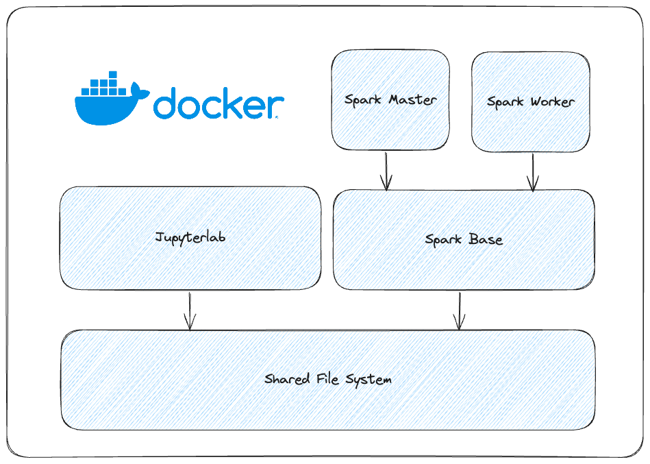
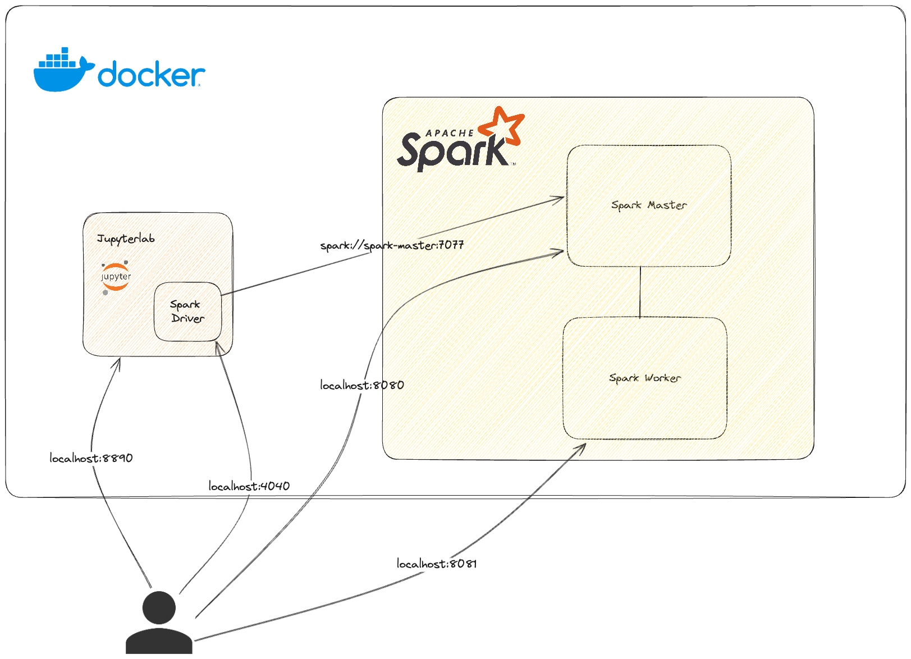

# Spark Infra Playground

## Docker Overview


## Architecture


## Run Infra

### Requirements
- [ ] Docker installed
- [ ] Git Installed

1. Open the folder with **Visual Studio Code**
2. (if windows) Open the file **build.sh** and in the botton right, change **CRLF** by **LF**, then with `git bash` run shell script.
4. Open a terminal (if windows use Gitbash instead)
    ```shell
    sh build.sh
    ```
5. Run `docker-compose up`
6. Go to local [Jupyterlab](http://localhost:8890/lab)
7. Inside the JupyterLab, open a terminal and clone the repository `https://github.com/jesonora/spark-course-notebooks`
